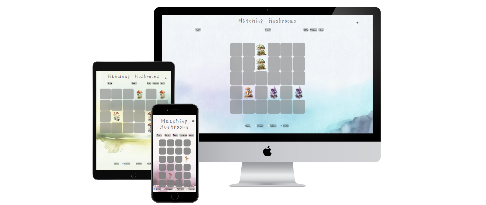
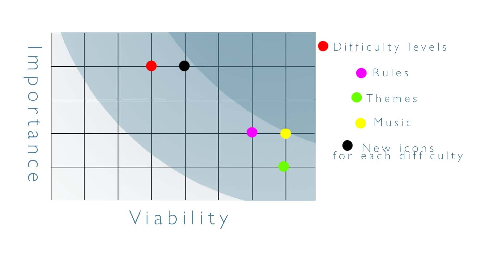
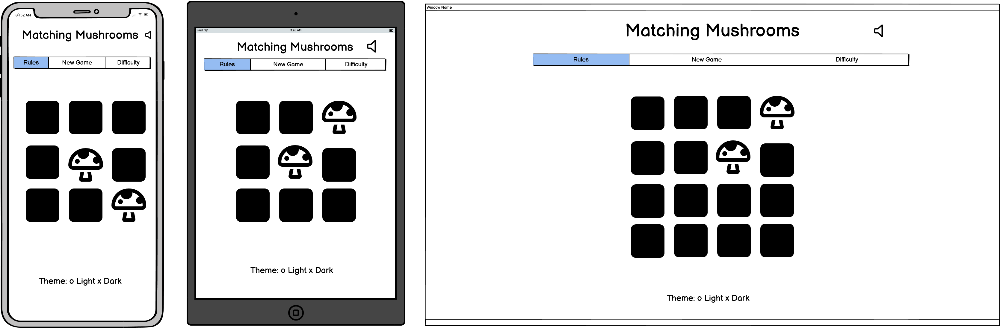
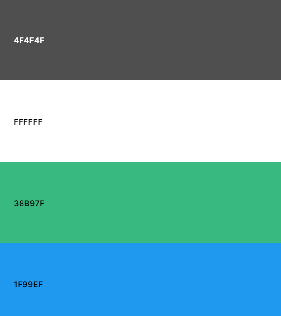

# Matching Mushrooms

## Code Institute Milestone Project 2

[Click here to view the live project](https://jpbiddle.github.io/Mushroom-Game/)

- [Mushroom Game](#matching-mushrooms)
  - [Table of Contents](#table-of-contents)
  - [Introduction](#introduction)
  - [UX](#ux)
  - [Features](#features)
  - [Issues and Bugs](#issues-and-bugs)
  - [Technology Used](#technologies-used)
  - [Testing](#testing)
  - [Deployment](#deployment)
  - [Credits](#credits)
  - [Acknowledgements](#acknowledgements)

## Introduction

Matching Mushrooms is a memory mini game designed to train the users memory to improve cognitave performance while also being an enjoyable, whimsical yet competitive game. 

The game is designed to be simple in nature, as the user is advised to focus on the memory part of the game and therefore simple is better - to avoid distractions.

This was the second Milestone Projects as part of my course at the Code Institute. The main requirements were to make an interactive and responsive website with HTML5, CSS and JavaScript.

***

## UX

### Demographics

The aim for me is to create a website that appeals to:

- New users
- Current users

### User Stories

#### New Users 

- As a new user, I want to find instructions on how to use the site easily.
- As a new user, I want the game to be engaging, beautifully designed and visually attractive.
- As a new user, I want to be able to navigate through the website easily.

#### Current Users

- As a current user, I want to be able to see my score from the game I just played at least.
- As a current user, I want to be able to play the game more than once and have a different experience the second time.
- As a current user, I want to have the option of playing the game with different difficulty settings.

***

## Development Planes

To create a game that will answer all of the user stories and will function as desired, the developer must include 1-3 levels of difficulty to the game, the ability to restart the game, functioning themes, music which can be muted, a rules section and an alert that the game has been won.

#### Strategy

The strategy was broken down by focussing on the essential elements of the game, as well as the different types of users that would access the game and what they will expect and want.

- roles
  - Current users
  - New Users
  - Users looking for a fun experience

- Demographic
  - All ages, typically children and people of learning ages
  - Residing in the UK or USA (English spoken)
  - An interest in games
  - Looking to improve memory

- Psychographic
  - Lifestyles
    - Enjoys playing games
    - Wishes to improve cognitave performance
    - Enjoys whimsical aesthetic
  - Personality and Attitudes
    - Creative
    - Open minded
- Values
  - Interested in new games
  - Interested in creator led content

This game needs to enable the user to:

- Play the game seamlessly without becoming stuck on a function of the game
- Be easily replayable
- Have rules that are easy to understand
- Be easy to control

The website needs to enable the site manager to:

- Update the style of the game easily
- Be flexible to upgrading with new features in future

With this in mind I have produced a short diagram representing the viability of elements versus importance within the site.

Viability chart

[Back to top](#matching-mushrooms)

***

### Scope

Based on the requirements of the Strategy plane, I have identified two categories.

- Content Requirements:
  - At least one array of mushroom icons for a game to be played
  - A colourful style with interesting images 
  - Music that suits the content

- Function Requirements:
  - The ability to play a card game that involves matching pairs
  - The ability to reset the game
  - The ability to turn music on and off
  - The ability to read a rules card
  - A message of congratulations at the end of the game

***

### Structure

Based on the information so far, I intend to have a single page structure where the entire game can be played, reset and controlled. This is important to keep the functionality clear and simple, therefore being more enjoyable to use.

***

### Skeleton

Wireframes were produced using balsamiq. These will showcase the site as intended on mobile and desktop.

Wireframes

***

### Surface

The majority of the colour will come from time background image, leaving the rest of the content to be styled being mostly buttons. 

The background will have four themes, one for each season. There is a theme of nature to the game, so this is fitting.

As each background will have a different colour, the rest of the colors must be versatile - therefore the text will be either black or white, with the black having a subtle opacity to turn slightly grey.

The rules and congratulations modal will be green, again to fit with the nature theme. 

With the buttons, headers and text colours decided, the last colour will be a sky blue to indicate a button has been pressed.

Colour Palette

### Typography

The typography I will use will be from Google Fonts.

The titles will be 'Shizuru', a font that has a hand written look to it which adds a quirky flavour to the styling. In keeping with this, the rest of the text in the site will be 'Gloria Hallelujah', another font with a handwritten feel.

### Imagery

All imagery will be purchased from sellers on Etsy, credit will be listed at the bottom of ReadMe.

[Back to top](#matching-mushrooms)

***

## Features

The game features a set of functional buttons in the header for controlling the game.
A row of radio buttons will be at the bottom of the page to change background theme.
The design of the page closely follows the wireframes.
The game will be presented in the centre of the page, taking up the most space.

***

### Reset

The reset function will be in the centre of the buttons at the top of the page.

This function will remove the array of mushrooms, reshuffle them and then place them back into the DOM, hidden again. 

***

### Rules

The rules button, to the left of reset, will open a modal explaining the aim of the game.

The modal will have an overlay to reduce the visibility of the rest of the page.

The modal will have a close button for when the user is finished with the modal.

*** 

### Difficulty setting

The difficulty buttons will be similar to the reset button, except they will generate an array of mushrooms that are more complex in design with the higher the difficulty.

As before, the function will remove the current array of mushrooms and generate a new shuffled array.

The grids with more cards to flip will have to be adjusted to fit on small screens.

The higher the difficulty chosen, the more pairs you will have to match.

***

### Themes

The theme selector will be a simple function that removes the current background url and replaces it with the image that corresponds with the season chosen.

The radio button will highlight which season is chosen with a check.

***

### Mushroom images

The images of the mushrooms will begin with a class that hides them.

On page load an array of the easy mushrooms will be generated.

When clicked, a card will reveal a mushroom and a second click will reveal another. Three cards cannot be revealed at one time.

***

### Match function

When two mushrooms that match are revealed, their original class which hid the mushroom will be permanently removed and the mushroom will also be gived a 'matched' class to be used to identify how many mushrooms in the array are matched.

Double clicking the first mushroom will not trigger a match.

***

### Game complete

When all the mushrooms are matched, a function will call to get the length of the array of mushrooms with the original class. when that is 0, the game is complete and a modal will be triggered to appear.

This will tell the user they have completed the game and encourage them to try harder levels.

*** 

### Future features

Due to time constraints I was unable to implement the following functions, however the would make a nice addition to the game:

- Game timer to either countdown or let the user time themselves
- High score or score counter
- Additional sounds on clicking buttons and cards

[Back to top](#matching-mushrooms)

***

## Issues and Bugs

### Image class not removing on flip()

When creating the flip function to reveal my card, I was able to add a class to reveal the mushroom but the contrast and opacity layers were still present meaning I was only showing a sihlouette of the mushroom on click. I spoke to my tutor joanna about this and was instructed to use 'this.classlist.remove' in order to fix the issue as I was using a variable followed by classlist.remove. After this conversation I was send some documentation by joanna guiding me with my function.

### Icons remaining hidden on mobile

Some icons were remaining hidden if they were adjacent to the icon that was previously clicked. This was because of a media query that was keeping the grid size and image size different to one another and therefore the click box was not as it was supposed to be. By adjusting the CSS of the grid I was able to resolve this.

### Music not  playing

I was struggling to get my music to play onload. Tutor jason sent a document explaining the DOM often wont allow this, but I was able to navigate a workaround by implementing a function that began the music when the user clicks anything for the first time.

### Modals not appearing

I found after creating the modals in HTML and Javascript they still wouldnt appear when called. The divs were there and console logs showed they worked. After research on modals I found I had mistakenly used some class names used for bootstrap (modal being one) and after adjusting this I was able to make the modals appear.

### Modals preventing the icon array from loading

The first problem I had with the modals was that it caused my onload  functions to break and not run. The simplest answer was to place the code into a seperat js file as the code was becoming crowded anyway.

***

## Technologies Used

***

### Main Languages Used

- HTML5
- CSS
- Javascript

### Frameworks, Libraries and Programs

- Google Fonts
  - GoogleFonts was used to import the Shizuru and Gloria Hallelujah fonts which were used in this project.
- Font Awesome
  - Font Awesome was used to import the Speaker icon for muting music.
- CodeAnywhere
  - CodeAnywhere was used for writing code, commiting and pushing to GitHub.
- GitHub
  - GitHub was used to store the project.
- Balsamiq
  - Balsamiq was used to create wireframes at the beginning of the project.
- Coolors
  - Coolors was used to create a simple colour palette for the website.
- FreeFormatter
  - FreeFormatter was used to beautify my HTML and CSS code and ensure it was optimal for reading.
- W3C Validator
  - W3C Validator was used at the end of the project to check forany errors written in my code for both HTML and CSS.
- w3Schools
  - Here I learned how to implement audio and change class items such as the background images.
- Youtube
  - I used extensively whenever I ran into a problem or something I had not done before such as creating modals.

***

## Testing

Please view full testing document [here](https://github.com/JPBiddle/Mushroom-Game/blob/main/TESTING.md)

***

## Deployment

***

This project was developed using CodeAnywhere and was then committed to GitHub using the GitPod terminal.

### Deploying

***

To deploy this page to GitHub Pages from its GitHub repository, the following steps were taken:

- Log into GitHub or create an account.
- Find the GitHub Repository.
- At the top of the repository, select Settings from the menu.
- At the bottom of the Settings page find the "Pages" section -located on the left hand navigation.
- Under "Source" click the drop-down menu labelled "None" and select "Main".
- Upon selection, the page will automatically refresh meaning that the website is now deployed.
- Scroll back down to the "Pages" section to find the deployed link.

***

## Credits

***

- Etsy users for mushroom icons - "ClipartCraftArt", "SileamDigital" and "DigitalDreamscaping"
- Etsy user "PeDeDesigns" for the backgrounds
- Music from Fable 1 video game OST (Bowerstone)
- Youtube user "Web Dev Simplified" for videos on modals and other javascript functions
- marina-ferreira on GitHub for her guide on making a matching card game,and tutor Joanna for showing me the guide
- w3schools, which I used to find how to implement audio, as well as reminders of code I have learnt at code institute

***

## Acknowledgements

***

- I would like to thank my family and friends for helping with testing and developing the user experience.
- I Would like to thank my mentor, Seun, for their guidance and experience, and my tutors, Jason and Joanne for helping me with any difficulties with bugs.
- I'd also like to thank the Code Institute Slack community who are always available for help.

[Back to top](#matching-mushrooms)

***

