# Mushroom Matching Testing

[Main README.md file](https://github.com/JPBiddle/Mushroom-Game/blob/main/README.md)

[View Live Project](https://jpbiddle.github.io/Mushroom-Game/)

# Contents

- [Mushroom Matching Testing](#mushroom-matching-testing)
- [Contents](#contents)
  - [Testing User Stories](#testing-user-stories)
    - [First time visitor](#first-time-visitor)
    - [Returning visitor](#returning-visitor)
  - [Manual Testing](#manual-testing)
  - [Automated Testing](#automated-testing)
    - [Code Validation](#code-validation)
    - [Lighthouse](#lighthouse)
  - [Further Testing](#further-testing)

---

## Testing User Stories

### First time visitor

- As a first time visitor, I would like to be able to control the functions of the game naturally and easily.

  - The Game begins with the easiest game mode and the rules are clearly displayed at the top of the page.
  - The site functions intuitively and its simplicity is its strength.
  - Buttons function as expected and gameplay is very straight forward.

- First time visitors want to explore all the functions as soon as arriving.

  - The game is playable on load at once, no menus are in the way or additional steps required.

- As a first time visitor I want to know how much there is to do on the game.
  - The difficulty levels are displayed clearly, as are the themes. The music is played for the user as soon as interaction starts.

### Returning visitor

- As a returning visitor, I would like to access the difficulty levels I had previously played on

  - The levels are all available to everyone

- As a returning visitor I would like a reminder of the rules.
  - As with other functions, rules are readily available to all users.

---

## Manual Testing

Extensive testing was conducted manually to ensure the game was working correctly across various screen sizes.
With every screen size (mobile, tablet and desktop), every function was tested. Below are screenshots of the testing in progress. Although functions such as theme will not show every background, they were all tested on each screen.

Every screen size was tested for matching pairs

Matching pairs on desktop

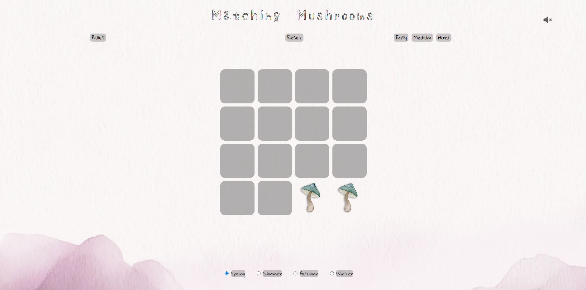

Matching pairs on tablet

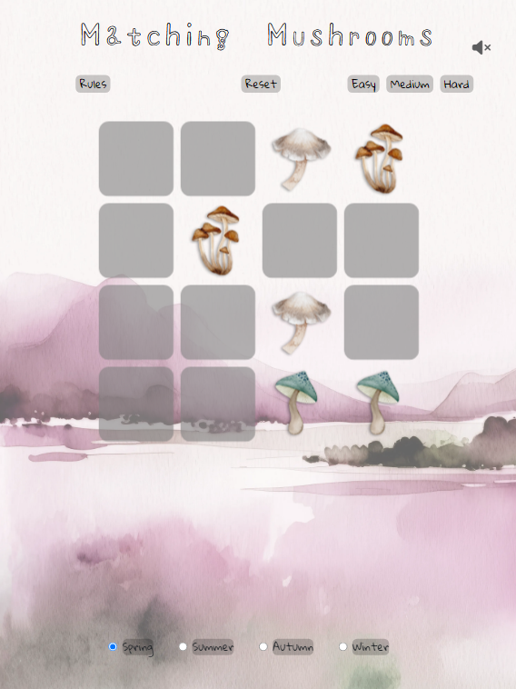

Matching pairs on tablet

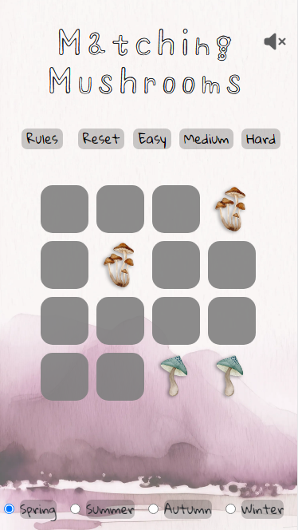

All screen sizes were also tested for reset function

Reset desktop

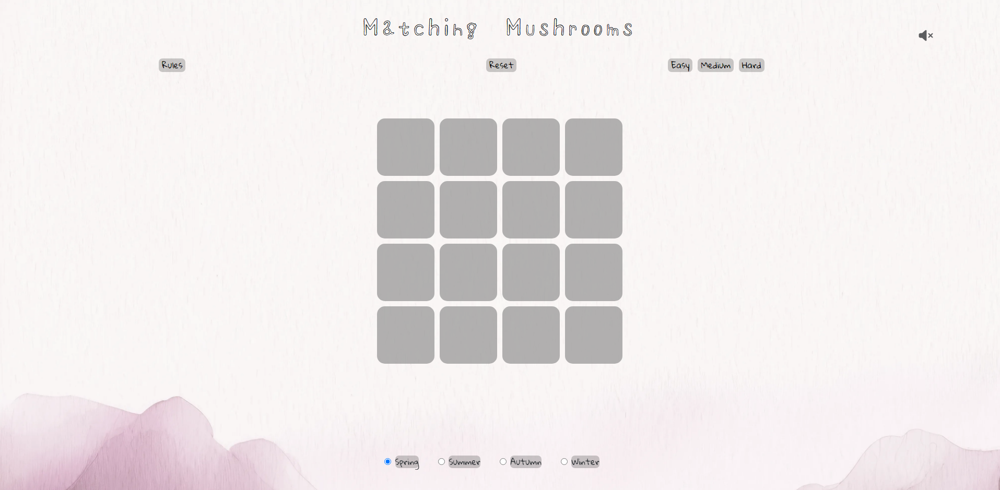

Reset tablet

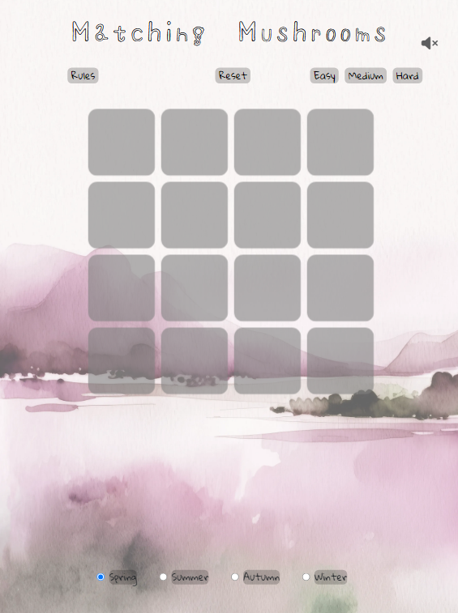

Reset mobile

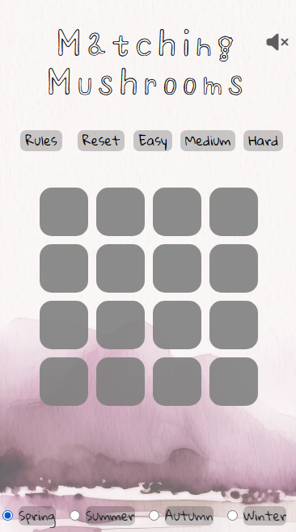

Themes were tested on all screen sizes

Theme Desktop

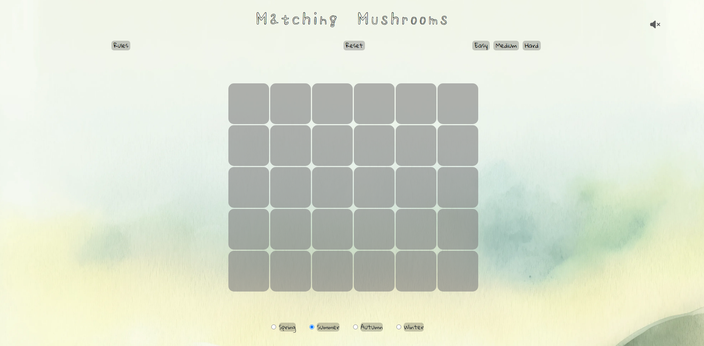

Theme tablet

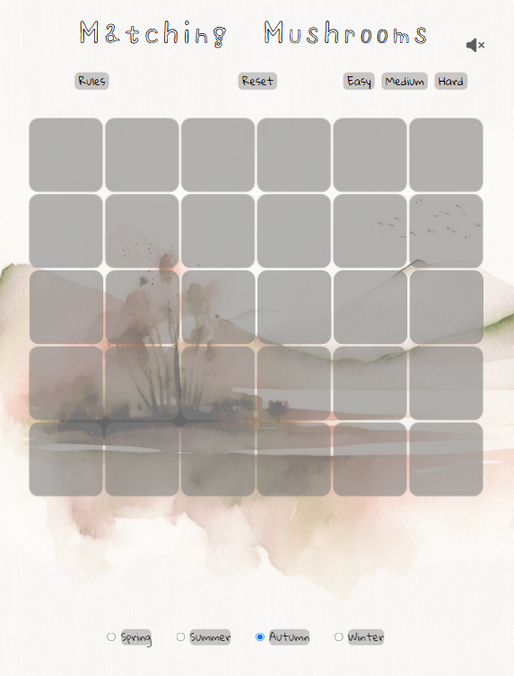

Theme mobile

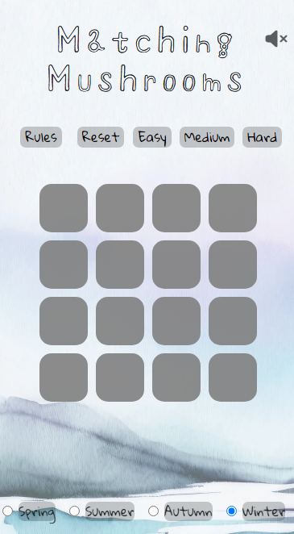

The rules were checked on every screen size

Rules Desktop

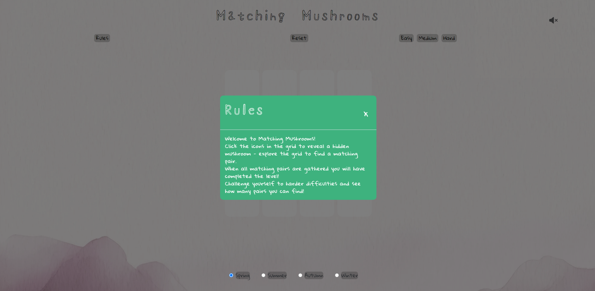

Rules tablet

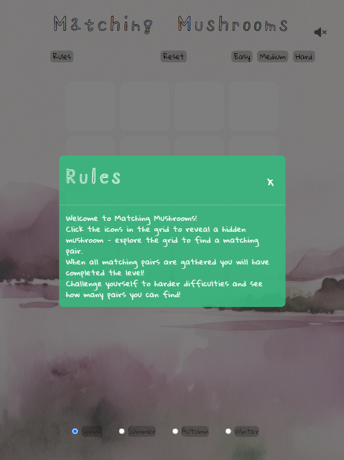

Rules mobile

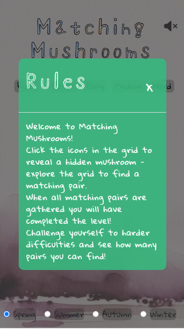

Difficulty modes were also all tested

Medium Mode Desktop

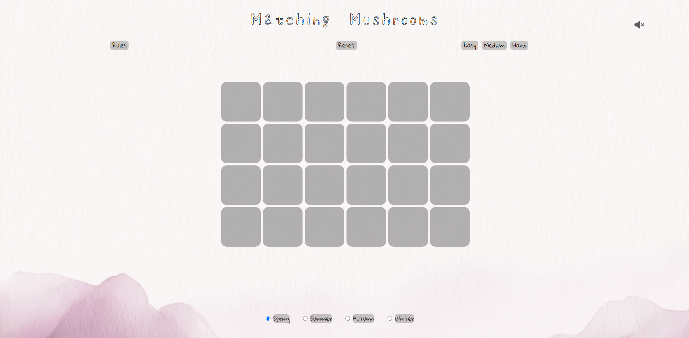

Hard Mode Desktop

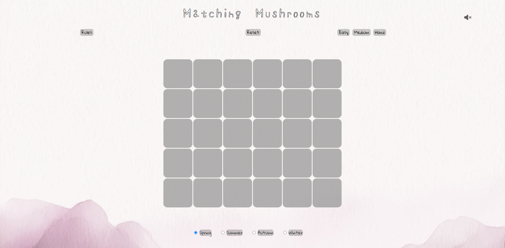

Medium Mode Tablet

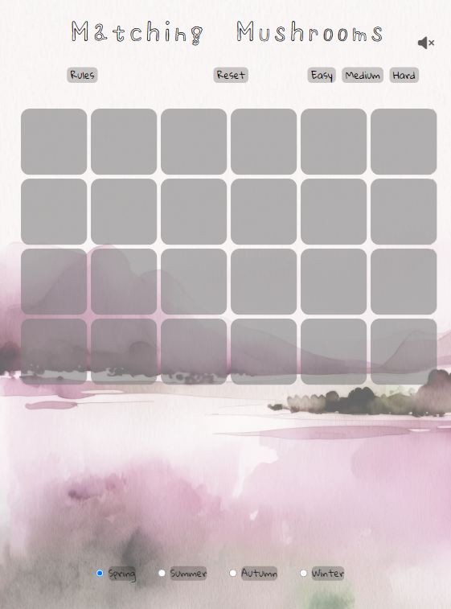

Hard Mode Tablet

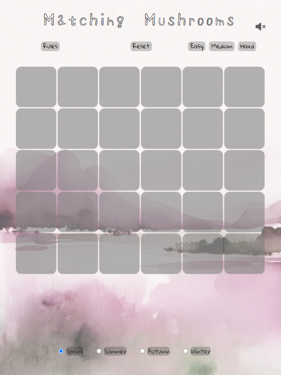

---

## Automated Testing

### Code Validation

I used the W3C markup validator to check that there were no syntax errors in my HTML or CSS. Any that were found were corrected until the result was as shown below - no errors.

W3C Validator

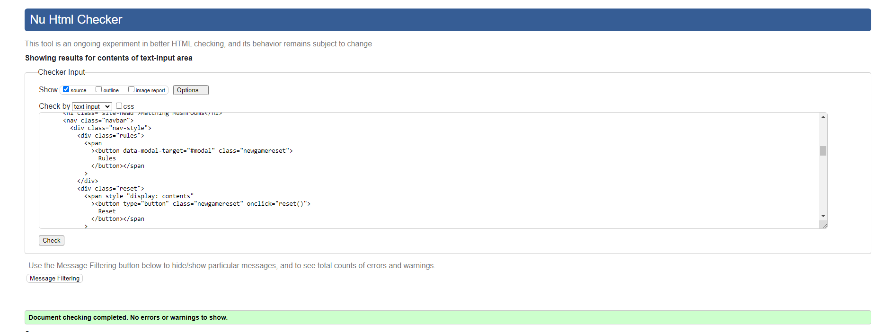

### Lighthouse

Part of my testing was using Lighthouse from Chrome to check accessibility, SEO performance and general loading performance.
Below is a screenshot of the current Lighthouse results.

Lighthouse Results

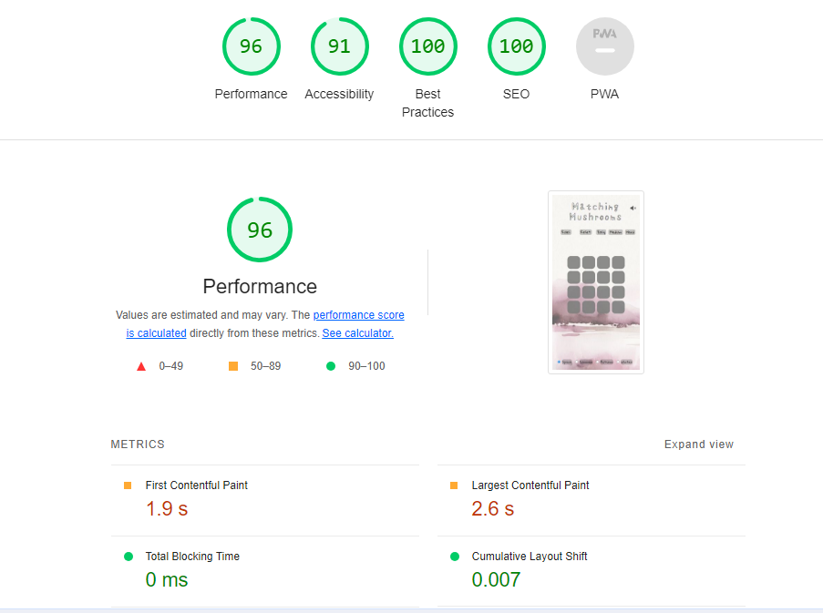

---

## Further Testing

The website was viewed on a variety of devices. This includes Windows desktop and latop, iphone 8 and 15 and Google pixel phone. Friends and family were asked to test and report any issues they had, where I was informed of a way to cheat the game! dragging images revealed them so I disable dragging to counter this.

---
